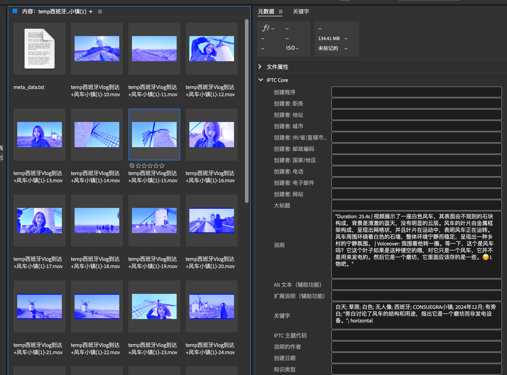
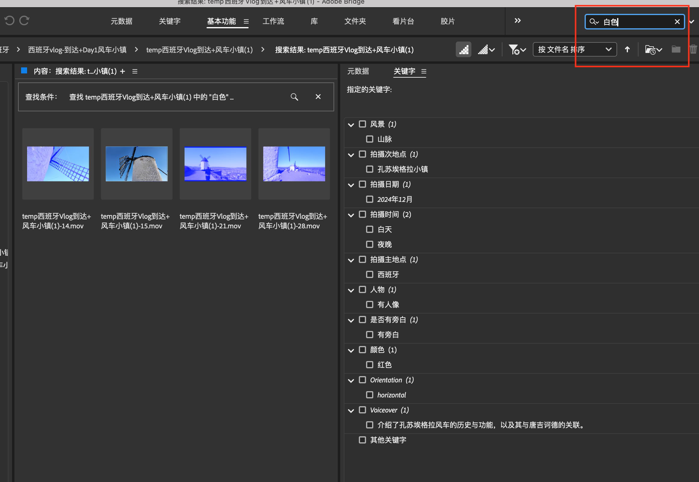
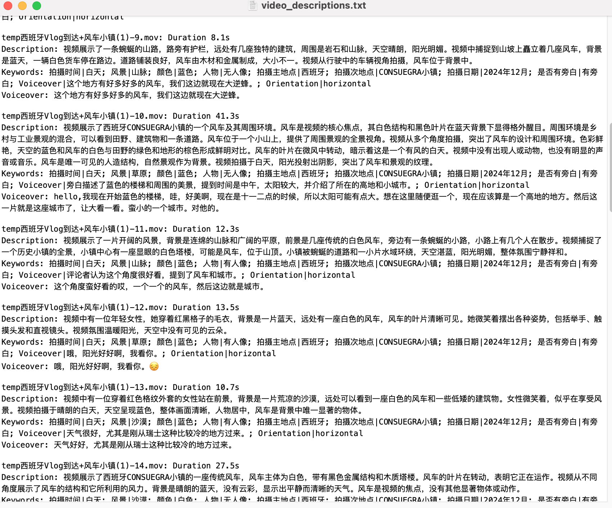

# Video Understanding & Tagging System

**Author: [寻找格陵兰](https://www.xiaohongshu.com/user/profile/5d8033da0000000001008fe0)🌴**

**AI Scientist × Travel Blogger** — an intelligent tool that addresses two major challenges: **managing large amounts of footage** and **producing creative content**. It’s now open-source to assist every content creator!

This repository discloses the core code we use to manage large volumes of travel videos. It primarily achieves **video content understanding**, **automatic tagging**, and generating a concise **description for each video**. The project integrates multimodal models (including *deepseek Janus*, *mPLUG-owl3*, and *sensevoice*) and leverages large language models (either *deepseek* or *Qwen*) to produce more accurate descriptions and tags. It can then work together with tools like *Adobe Bridge* for video tagging, content search, and narration retrieval. Additionally, you can generate script outlines for platforms such as Rednote or Tiktok based on the descriptions.

---

## Features

- **Video Scene Understanding (Local Deployment)**  
  Analyze keyframes (I-frames) using *deepseek Janus* to extract static information such as scene context.

- **Full Video Understanding (Local Deployment)**  
  Use *mPLUG-owl3* to analyze the entire video’s dynamic information, including people, objects, and scenes.

- **Audio Analysis (Local Deployment)**  
  Employ *sensevoice* for audio analysis and extracting dialogue, providing textual information for content summarization and tag generation.

- **Tag and Video Description Generation (via API)**  
  Based on multimodal information, call a large language model (*deepseek*/ *Qwen*) to generate tags, summaries, or descriptions.

- **Search and Management (Local Deployment)**  
  When combined with Adobe Bridge or similar tools, you can search for video clips by keywords.

- **Creative Content Production**  
  Combine video descriptions, tags, and extracted dialogue to generate viral script outlines for Rednote or Tiktok.

---

## **Usage Guide** [Video Introduction on Rednote](http://xhslink.com/a/C4S7v7vCThN5)

### **1. Automatic Video Tag Generation**
The project automatically analyzes video content and narration to create multiple keyword tags, including scene, time, location, color, and more.
  



### **2. Keyword-based Search**
Users can enter keywords (e.g., “白色”) to quickly find relevant videos. The project will automatically filter clips that match the query and display them.



### **3. Video Description Generation**
In addition to tags, the system generates detailed descriptions of the video based on its content and stores them as text files for further organization and management.



### **4. Language Support**
The current system only supports Chinese, but you can modify the prompts (located in the `config/prompts` folder) to generate tags and descriptions in English or other languages.

## System Environment

Because *deepseek Janus* and *mPLUG-owl3* have some conflicting dependencies, this project is developed mainly under Janus’s environment, with some additional packages installed. Meanwhile, *mPLUG-owl3* dependencies are installed in a **separate virtual environment** and invoked via `subprocess`.

- **Development & Testing Environment**  
  - Mac mini M2 Pro, 24GB Unified Memory  
  - Tested only on this configuration. If you need to run on a CUDA environment or a pure CPU environment, adjust parameters and paths in the code accordingly.
  
- **Deep Learning Dependencies**  
  - deepseek Janus
  - mPLUG-owl3
  - sensevoice
  - Other dependencies listed in `requirements.txt`

---

## Installation & Configuration

### 1. Clone the Repository

```bash
git clone --recursive https://github.com/greenland-dream/video-understanding.git
cd video-understanding
```

### 2. Install Dependencies

This project relies on multiple model environments. Please follow the steps below:

1. **Install Janus Dependencies**  
   Navigate to the `modules/Janus` directory and install Janus-related dependencies:
   ```bash
   cd modules/Janus
   pip install -e .
   cd ../..
   ```

2. **Install Main Project Dependencies**  
   In the main directory, install the dependencies listed in `requirements.txt`:
   ```bash
   pip install -r requirements.txt
   ```

3. **Install mPLUG-owl3 Dependencies**  
   Go to the `modules/mPLUG-Owl/mPLUG-Owl3` directory and install the `mPLUG-owl3` dependencies **in a separate virtual environment**:
   ```bash
   conda create -n owl3 python=3.9
   conda activate owl3
   cd modules/mPLUG-Owl/mPLUG-Owl3
   pip install -r requirements.txt
   cd ../../..
   conda deactivate
   ```

4. **Running the Project**  
   **The entire project is run under the Janus environment**. In other words, use the environment where Janus is installed to execute the main code, while `mPLUG-owl3` tasks will be invoked as a subprocess using `owl3`.

### 3. Configure Models & Environment

- Modify `config/model_config.yaml` to provide the path to your `mPLUG-owl3` virtual environment.
- Copy `config/api_configs.json.example` to `config/api_configs.json` and fill in the necessary API keys. Currently supports *deepseek*, *qwen*, *azure*, *github*, *openrouter*, etc. You can configure the priority of each API provider in `config/api_configs.json`, and the code supports dynamically switching among them.

### **4. Running an Example**

This project processes **a specified folder path** in the Python code. Follow these steps:

1. **Open `main.py`:**  
   Replace `"your_folder_path"` with your video folder path, for instance:
   ```python
   folder_paths = [
       "/home/user/videos"  # e.g., your video folder
   ]
   ```

2. **Add a meta_data.txt File**  
   Inside the `"/home/user/videos"` folder, add a `meta_data.txt` file that contains a brief description (one sentence) of the videos’ shoot time/location. For example:
   ```bash
   These videos were shot in December 2024 in the town of CONSUEGRA, Spain.
   ```

3. **Run the Python code**:
   ```bash
   python main.py
   ```

   The code will iterate through each folder listed in `folder_paths` and automatically process any videos within them.

⚠️ **Note**:
- You can add multiple folder paths to `folder_paths`; each folder must contain a `meta_data.txt`.
- Make sure the paths are formatted correctly, such as:
  - macOS/Linux: `"/Users/yourname/Videos"`

---

## Project Structure

```
.
├── config/            # Configuration files
├── docs/              # Documentation
├── modules/           # Core modules
├── utils/             # Utility functions
├── main.py            # Main entry script
├── requirements.txt   # Dependency list
└── README.md          # Documentation
```

---

## License

This project is released under the [MIT License](LICENSE).

---

## Contributing

Pull Requests and Issues are welcome!

---

## Acknowledgments

- [deepseek Janus](https://github.com/deepseek-ai/Janus.git)  
- [mPLUG-owl3](https://github.com/X-PLUG/mPLUG-Owl.git)  
- [sensevoice](https://github.com/FunAudioLLM/SenseVoice.git)

Thank you to everyone who has supported and contributed to this project!
