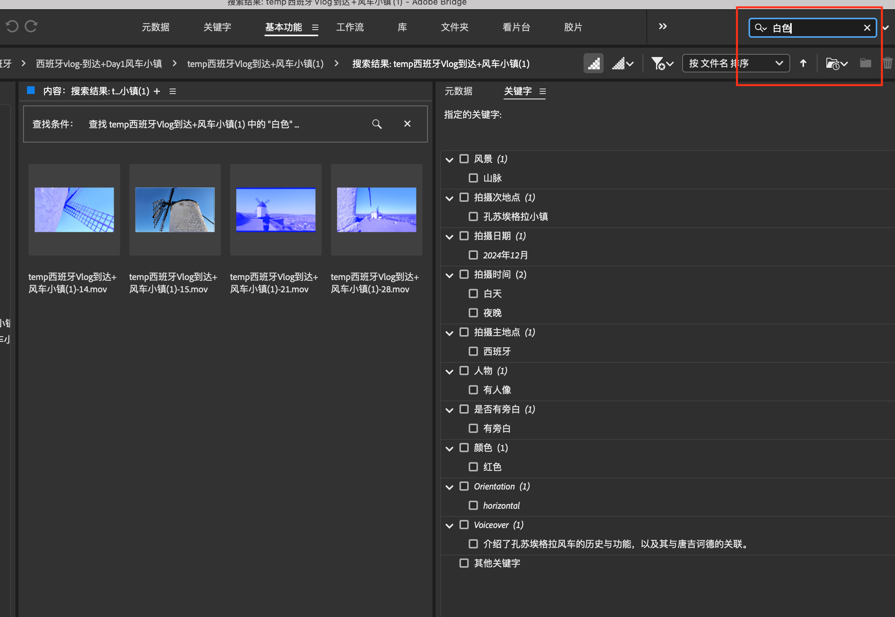
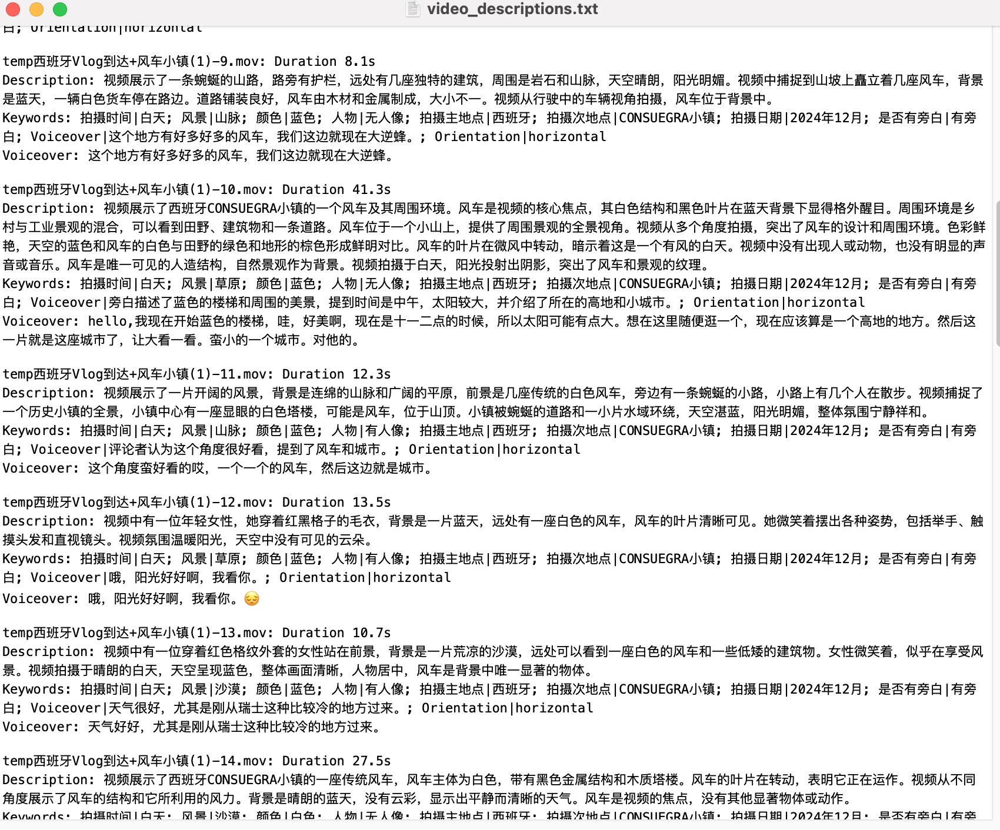

# 视频理解与搜索系统 (Video Understanding & Retrieval System)

**中文 | [English](README.md)**

**作者：[寻找格陵兰](https://www.xiaohongshu.com/user/profile/5d8033da0000000001008fe0)🌴** 

**AI Scientist × 旅行博主** — 一款智能工具，解决两大主要挑战：**管理海量素材** 和 **制作创意内容**。现已开源，助力每一位内容创作者！

本仓库公开了我们在管理大量旅行视频时使用的核心代码，主要实现对视频内容的理解与自动打标签功能，对每个视频生成一个描述，并把这些视频信息写入向量数据库。该项目融合了多模态模型（包括 deepseek Janus、mPLUG-owl3 和 sensevoice），并通过大模型（deepseek 或者 Qwen）生成更精准的描述和标签。系统还提供自然语言查询功能，可以通过语义搜索快速找到所需视频素材，并配备了Web界面进行可视化管理。后续可配合 Bridge 等视频管理软件，对视频标签，内容以及旁白进行检索。还可以根据视频素材的描述，生成小红书/抖音的剪辑脚本。


---

## 功能特点 

- **视频场景理解 （本地部署）**  
  通过 deepseek Janus 分析关键帧（I帧）并获取场景等静态信息。

- **整段视频理解 （本地部署）**  
  借助 mPLUG-owl3 分析整段视频内容，包括人物、物体及场景的动态信息。

- **音频分析（本地部署）**  
  利用 sensevoice 对音频进行分析与对话提取，为进一步的文本总结和标签生成提供依据。

- **标签与视频描述生成 （调用API）**  
  基于多模态信息并调用大模型（deepseek/Qwen）生成视频标签、摘要或描述。

- **数据库存储与检索 （本地部署）**  
  使用结构化数据库（SQLite）和向量数据库（ChromaDB）存储视频分析结果，支持高效检索。

- **自然语言视频搜索 （本地部署）**  
  通过 query.py 实现自然语言查询，利用向量相似度搜索找到最匹配的视频。

- **Web界面管理与搜索 （本地部署）**  
  提供基于Flask的Web界面，支持视频浏览、搜索、预览和导出功能。

- **检索与管理 （本地部署）**  
  当结合 Adobe Bridge 等视频管理工具，可根据关键词检索视频位置。

- **创意内容生产**  
  结合视频描述、标签、音频对话，生成小红书/抖音爆文脚本。

### System Diagram 


---

## **使用指南** [视频介绍(小红书笔记)](http://xhslink.com/a/C4S7v7vCThN5)

### **1. 视频自动标签生成**
项目会自动分析视频内容及旁白，并为视频生成多个关键字标签，包括场景、时间、地点、颜色等信息。
  


### **2. 关键词搜索功能**
用户可以输入关键字（例如 "白色"）来快速查找相关视频。项目会自动筛选符合条件的片段并展示结果。



### **3. 视频描述生成**
除了标签，系统还会基于视频内容生成详细的描述，并存储为文本文件，便于整理和管理。



### **4. 自然语言视频查询**
使用 query.py 可以通过自然语言查询视频库，找到最匹配的视频内容：

```bash
python query.py "帮我找到描述大峡谷的视频，有人在行走，阴天，人物在感叹这里很美"
```

系统会返回最匹配的视频列表，包括相似度分数、视频描述和元数据信息。

### **5. Web界面管理**
启动Web界面，可以通过浏览器进行视频管理和搜索：

```bash
cd web
python app.py
```

Web界面功能包括：
- 视频库统计信息查看
- 选择文件夹进行视频处理
- 自然语言搜索视频
- 视频预览和播放
- 导出选定视频到指定文件夹


## 系统环境说明 

由于 deepseek Janus 与 mPLUG-owl3 在依赖包上存在冲突，本项目主要在 Janus 的环境上开发，并额外安装了一些包；同时，需要在一个单独的虚拟环境中安装 mPLUG-owl3 的依赖，通过 `subprocess` 调用来实现。

- **开发测试环境:**  
  - Mac mini m4 Pro, 64GB Unified Memory  
  - 仅在此配置上进行了测试；如需在 CUDA 环境或纯 CPU 环境运行，需要在代码中进行相应的参数和路径配置调整。
  
- **深度学习依赖:**  
  - deepseek Janus
  - mPLUG-owl3
  - sensevoice
  - 以及其他在 `requirements.txt` 中列出的依赖库

- **数据库依赖:**
  - SQLite (结构化数据存储)
  - ChromaDB (向量数据库)
  - HuggingFace Embeddings (向量嵌入)

---

## 安装与配置 

### 1. 克隆仓库 

```bash
git clone --recursive https://github.com/greenland-dream/video-understanding.git
cd video-understanding
```

### 2. 安装依赖 

本项目依赖多个模型环境，安装顺序如下：  

1. **安装 Janus 依赖**  
   进入 `modules/Janus` 目录并安装 Janus 相关依赖：
   ```bash
   cd modules/Janus
   pip install -e .
   cd ../..  # 返回主目录
   ```

2. **安装主项目依赖**  
   在主目录下安装 `requirements.txt` 中的依赖：
   ```bash
   pip install -r requirements.txt
   ```

3. **安装 mPLUG-owl3 依赖**  
   进入 `modules/mPLUG-Owl/mPLUG-Owl3` 目录，并在 **单独的虚拟环境** 中安装 `mPLUG-owl3` 依赖：
   ```bash
   conda create -n owl3 python=3.9  # 创建 mPLUG-owl3 专用环境
   conda activate owl3
   cd modules/mPLUG-Owl/mPLUG-Owl3
   pip install -r requirements.txt
   cd ../../..  # 返回主目录
   conda deactivate  # 退出虚拟环境
   ```

4. **运行项目**  
   **整个项目需在 Janus 环境下运行**，即使用 Janus 依赖环境来执行主程序，而 `mPLUG-owl3` 相关任务将在子进程中调用 `owl3` 运行。


### 3. 配置模型与环境

- 修改 `config/model_config.yaml`，填写 mPLUG-owl3 虚拟环境路径。
- 复制 `config/api_configs.json.example` 到 `config/api_configs.json` 并填入必要的 API 密钥。目前支持 deepseek、siliconflow、azure、github、openrouter、qwen 六种 API。可以在`config/api_configs.json`配置每个API 服务商的优先级。代码支持动态切换API 服务商。

### **4. 运行示例**

本项目提供多种运行方式：

#### 4.1 视频处理（main.py）

1. **打开 `main.py`**：

   将 `"your_folder_path"` 替换为你的视频文件夹路径，例如：
   ```python
   folder_paths = [
       "/home/user/videos"  # 例如你的视频存放路径
   ]
   ```

2. **添加meta_data.txt文件** 在视频文件夹 `"/home/user/videos"` 中，添加一个meta_data.txt文件，一句话描述该组视频的拍摄时间地点。比如
   ```bash
   这个组视频是于2024年12月在西班牙CONSUEGRA小镇拍的。
   ```

3. **运行 Python 代码**：
   ```bash
   python main.py
   ```

   代码将会遍历 `folder_paths` 中指定的所有文件夹，并自动处理其中的视频文件。

#### 4.2 视频查询（query.py）

处理完视频后，可以使用自然语言查询来搜索视频：

```bash
python query.py "帮我找到描述大峡谷的视频，有人在行走，阴天，人物在感叹这里很美"
```

系统会返回最匹配的视频列表，按相似度排序。

#### 4.3 Web界面（web/app.py）

启动Web界面进行可视化管理：

```bash
cd web
python app.py
```

然后在浏览器中访问 http://127.0.0.1:5000 即可使用Web界面。

⚠️ **注意**：
- 你可以在 `folder_paths` 列表中添加多个文件夹路径(文件夹中需要包含`meta_data.txt`文件)，代码会逐个处理。
- 请确保路径格式正确，例如：
  - macOS/Linux: `"/Users/yourname/Videos"`
- 数据库文件将存储在 `db/data/` 目录下，包括SQLite数据库和ChromaDB向量数据库。

---

## 项目结构

```
.
├── config/            # 配置文件 
├── db/                # 数据库文件
│   ├── data/          # 存储SQLite和ChromaDB数据
│   └── video_db.py    # 数据库操作类
├── docs/              # 文档
├── modules/           # 核心模块 
│   ├── video_query/   # 视频查询模块
│   └── ...
├── utils/             # 工具函数 
├── web/               # Web界面
│   ├── app.py         # Flask应用
│   ├── static/        # 静态资源
│   └── templates/     # HTML模板
├── main.py            # 主程序入口（视频处理）
├── query.py           # 查询程序入口（视频搜索）
├── requirements.txt   # 依赖列表 
└── README.md          # 说明文档 
```

---

## 许可证

本项目采用 [MIT License](LICENSE)。  

---

## 贡献指南

欢迎提交 Pull Requests 和 Issues！  

---

## 致谢

- [deepseek Janus](https://github.com/deepseek-ai/Janus.git)  
- [mPLUG-owl3](https://github.com/X-PLUG/mPLUG-Owl.git)  
- [sensevoice](https://github.com/FunAudioLLM/SenseVoice.git)  

感谢所有对本项目提供支持和帮助的朋友们！  
