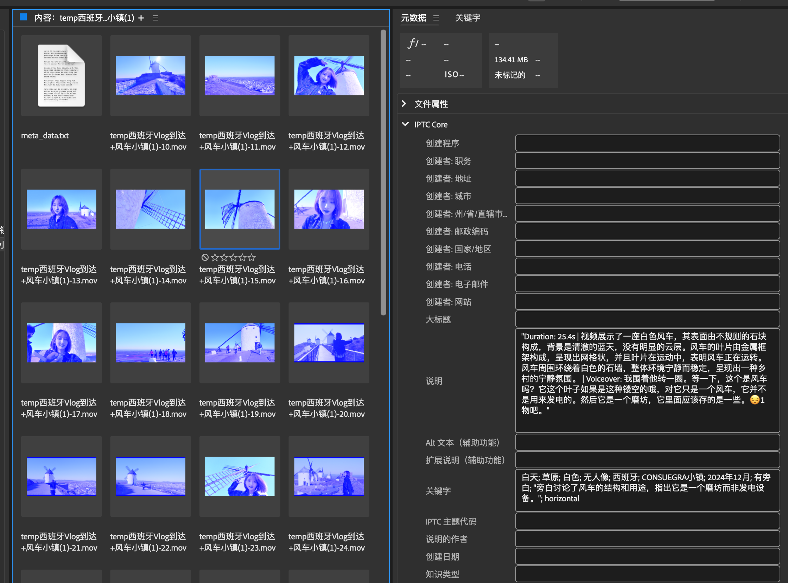

# 视频理解与搜索系统 (Video Understanding & Retrieval System)

**中文 | [English](README.md)**

**作者：[寻找格陵兰](https://www.xiaohongshu.com/user/profile/5d8033da0000000001008fe0)🌴** 

**AI Scientist × 旅行博主** — 一款智能工具，解决两大主要挑战：**管理海量素材** 和 **制作创意内容**。现已开源，助力每一位内容创作者！

本仓库公开了我们在管理大量旅行视频时使用的核心代码，主要实现对视频内容的理解与自动打标签功能，对每个视频生成一个描述，并把这些视频信息写入向量数据库。该项目融合了多模态模型（包括 Google Gemma3 和 sensevoice），并通过大模型生成更精准的描述和标签。系统还提供自然语言查询功能，可以通过语义搜索快速找到所需视频素材，并配备了Web界面进行可视化管理。后续可配合 Bridge 等视频管理软件，对视频标签，内容以及旁白进行检索。还可以根据视频素材的描述，生成小红书/抖音的剪辑脚本。


---

## 功能特点 

- **视频场景理解 （本地部署）**  
  通过 Google Gemma3 分析视频内容，包括人物、物体及场景的动态信息。

- **音频分析（本地部署）**  
  利用 sensevoice 对音频进行分析与对话提取，为进一步的文本总结和标签生成提供依据。

- **标签与视频描述生成 （调用API）**  
  基于多模态信息并调用大模型生成视频标签、摘要或描述。

- **数据库存储与检索 （本地部署）**  
  使用结构化数据库（SQLite）和向量数据库（ChromaDB）存储视频分析结果，支持高效检索。

- **自然语言视频搜索 （本地部署）**  
  通过 query.py 实现自然语言查询，利用向量相似度搜索找到最匹配的视频。

- **Web界面管理与搜索 （本地部署）**  
  提供基于Flask的Web界面，支持视频浏览、搜索、预览和导出功能。

- **检索与管理 （本地部署）**  
  当结合 Adobe Bridge 等视频管理工具，可根据关键词检索视频位置。

- **创意内容生产**  
  结合视频描述、标签、音频对话，生成小红书/抖音爆文脚本。

### System Diagram 


---

## **使用指南** [视频介绍(小红书笔记)](http://xhslink.com/a/C4S7v7vCThN5)

### **1. 视频自动标签生成**
项目会自动分析视频内容及旁白，并为视频生成多个关键字标签，包括场景、时间、地点、颜色等信息。
  



### **2. 关键词搜索**
用户可输入关键词（如"白色"）快速查找相关视频，系统将自动过滤匹配查询的片段并显示它们。


### **3. 视频描述生成**
除标签外，系统基于视频内容生成详细描述，并将其存储为文本文件便于管理与组织。


### **4. 自然语言视频查询**
使用query.py实现自然语言视频查询：

```bash
python query.py "请帮我找到描述西班牙小镇风车的视频，白色的风车，晴朗蓝天"
```

系统将返回一个最匹配的视频列表，包含相似度分数、视频描述与元数据信息。

### **5. Web界面管理**
启动Web界面进行可视化管理：

```bash
cd web
python app.py
```

Web界面功能包括：
- 查看视频库统计数据
- 选择文件夹进行视频处理
- 自然语言视频搜索
- 视频预览与播放
- 将选定视频导出到指定文件夹


### **5.1 CLIP相似性生成**
此功能通过检测场景/片段并为每个片段查找相似视频来分析视频：

```bash
python tools/clip_similarity_finder.py --video_path /path/to/your/video.mp4 --output_dir /path/to/output
```

主要功能：
- 自动检测视频中的场景变化
- 分析每个片段的音频、视频帧和动作
- 使用多线程为每个片段查找相似视频
- 确保每个相似视频在所有片段中只使用一次
- 以清晰的目录结构组织结果
- 支持背景信息引导视频选择

高级选项：
```bash
python tools/clip_similarity_finder.py --video_path /path/to/video.mp4 --output_dir /path/to/output --threshold 30 --min_duration 1.0 --max_threads 8 --background "需要欧洲城市风格的视频，色调偏暖"
```

### **5.2 文本相似性查找器**
此功能查找匹配文本描述或指令的视频：

```bash
python tools/text_similarity_finder.py --text "你的文本或指令" --output_dir /path/to/output
```

主要功能：
- 将输入文本拆分为有意义的段落
- 为每个段落生成视觉描述
- 为每个描述查找相似视频
- 可将简短指令扩展为完整视频脚本
- 支持背景信息引导视频选择

高级选项：
```bash
# 使用文本文件作为输入
python tools/text_similarity_finder.py --text_file /path/to/text_file.txt --output_dir /path/to/output

# 扩展指令并设置目标时长
python tools/text_similarity_finder.py --text "创建一个关于春天的短视频" --is_instruction --target_duration 30 --output_dir /path/to/output

# 使用背景信息
python tools/text_similarity_finder.py --text "樱花盛开的季节" --background "需要欧洲城市风格的视频，色调偏暖" --output_dir /path/to/output
```

## 系统环境

系统现在使用基于Google Gemma3的单一模型环境架构，简化了部署流程。

- **开发与测试环境**  
  - Mac mini M4 Pro, 24GB 统一内存  
  - 仅在此配置上测试过。如需在CUDA环境或纯CPU环境运行，请相应调整代码中的参数和路径。
  
- **深度学习依赖**  
  - Google Gemma3 用于视频理解
  - sensevoice 用于音频转录
  - 其他依赖列在`requirements.txt`中

- **数据库依赖**
  - SQLite（结构化数据存储）
  - ChromaDB（向量数据库）
  - HuggingFace Embeddings（向量嵌入）

---

## 安装与配置

### 1. 克隆仓库

```bash
git clone https://github.com/greenland-dream/video-understanding.git
cd video-understanding
```

### 2. 安装依赖

```bash
pip install -r requirements.txt
```

### 3. 配置模型与环境

- 修改`config/model_config.yaml`配置API提供商优先级。
- 将`config/api_configs.json.example`复制为`config/api_configs.json`并填入必要的API密钥。目前支持*siliconflow*、*deepseek_call*、*github_call*、*azure_call*、*qwen_call*等API。你可以在配置文件中设置每个API提供商的优先级，代码支持动态切换。

### **4. 运行示例**

本项目提供多种运行方式：

#### 4.1 视频处理 (main.py)

1. **打开`main.py`：**  
   将"your_folder_path"替换为你的视频文件夹路径，例如：
   ```python
   folder_paths = [
       "/home/user/videos"  # 例如，你的视频文件夹
   ]
   ```

2. **添加meta_data.txt文件**  
   在"/home/user/videos"文件夹内，添加一个`meta_data.txt`文件，包含视频拍摄时间/地点的简短描述（一句话）。例如：
   ```bash
   这些视频是2024年12月在西班牙CONSUEGRA小镇拍摄的。
   ```

3. **运行Python代码**：
   ```bash
   python main.py
   ```

   代码将遍历`folder_paths`中列出的每个文件夹，并自动处理其中的任何视频。

#### 4.2 视频查询 (query.py)

处理视频后，你可以使用自然语言查询来搜索视频：

```bash
python query.py "请帮我找到描述西班牙小镇风车的视频，白色的风车，晴朗蓝天"
```

系统将返回一个最匹配的视频列表，按相似度排序。

#### 4.3 Web界面 (web/app.py)

启动Web界面进行可视化管理：

```bash
cd web
python app.py
```

然后在浏览器中访问http://127.0.0.1:5000使用Web界面。

⚠️ **注意**：
- 你可以在 `folder_paths` 列表中添加多个文件夹路径(文件夹中需要包含`meta_data.txt`文件)，代码会逐个处理。
- 请确保路径格式正确，例如：
  - macOS/Linux: `"/Users/yourname/Videos"`
- 数据库文件将存储在 `db/data/` 目录下，包括SQLite数据库和ChromaDB向量数据库。


---

## 项目结构

```
.
├── config/            # 配置文件 
├── db/                # 数据库文件
│   ├── data/          # 存储SQLite和ChromaDB数据
│   └── video_db.py    # 数据库操作类
├── docs/              # 文档
├── modules/           # 核心模块 
│   ├── video_query/   # 视频查询模块
│   └── ...
├── tools/             # 工具程序
│   ├── clip_similarity_finder.py  # 为视频中的每个片段查找相似视频
│   └── text_similarity_finder.py  # 查找与文本描述匹配的视频
├── utils/             # 工具函数 
├── web/               # Web界面
│   ├── app.py         # Flask应用
│   ├── static/        # 静态资源
│   └── templates/     # HTML模板
├── main.py            # 主程序入口（视频处理）
├── query.py           # 查询程序入口（视频搜索）
├── requirements.txt   # 依赖列表 
└── README.md          # 说明文档 
```

---

## 许可证

本项目采用 [MIT License](LICENSE)。  

---

## 贡献指南

欢迎提交 Pull Requests 和 Issues！  

---

## 致谢

- [Google Gemma3](https://github.com/google-research/gemma3.git)  
- [sensevoice](https://github.com/FunAudioLLM/SenseVoice.git)  

感谢所有对本项目提供支持和帮助的朋友们！  
